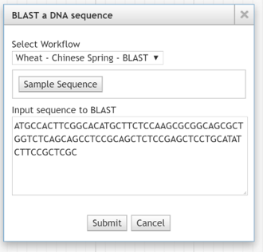

*********************
Configuration Options
*********************

Setup Galaxy Server for Blast processing.

Configuration Files
===================

.. _jbl-globals-js

globals.js
----------

Modify the configuration file as necessary.

To view aggregate configuration: ``./jbutil --config``

The aggregate config file is the merged config of JBConnect and its installed jbconnect-hook-*
modules.

Edit config file: ``nano config/globals.js``

:: 

    module.exports.globals = {
        jbrowse: {
            galaxy: {
                galaxyUrl: "http://localhost:8080",                 // URL of Galaxy

                galaxyPath: "/var/www/html/galaxy",                 // path of Galaxy
                //galaxyPath: "/var/www/html/galaxy_jblast",        // path of Galaxy, if docker

                galaxyAPIKey: "c7be32db9329841598b1a5705655f633",   //

                // jblast will use this Galaxy history
                historyName: "Unnamed history"                      // default history name
            },
            jblast: {
                blastResultPath: "jblastdata",                      
                blastResultCategory: "JBlast Results",
                insertTrackTemplate: "inMemTemplate.json",
                import: ["blastxml"]
            }
        }
    };

* ``blastResultPath`` is the sub directory within the dataset directory where the blast results are stored
* ``blastResultCategory`` is the name of the JBrowse track selectory category.
* ``insertTrackTemplate`` is the track insertion template.
* ``import`` is the file extension to process from the Galaxy workflow.

Standalone Blast Job Service
============================

The job service, basicWorkdlowService, is the job runner service that manages stand-alone 
Blast processing.

Requirements
------------

These requirements are generally installed as part of the JBlast project.

::

    npm install enuggetry/blast-ncbi-tools  (NCBI blast)
    npm install enuggetry/faux-blastdb      (a small sample blast database)

Configuration
-------------

Add the following to the jbconnect.config.js file, enabling basicWorkflowService:

::

    module.exports  = {
        jbrowse: {
            services: {
                'basicWorkflowService':     {enable: true,  name: 'basicWorkflowService',  type: 'workflow', alias: "jblast"},
                'galaxyService':            {enable: false, name: 'galaxyService',         type: 'workflow', alias: "jblast"}
        },
        }
    };

featureMapping flag
-------------------

featureMapping defines how the target features mapped into coordinate space.

'hit' - target features will be mapped into target coordinates.
'query' (default) - target features will be mapped into query space on the in the contig where the query is made.

If featureMapping='hit', then contigHandler() function will be needed to decipher the proper contig of the feature. 
If featureMapping='query', then the contigHandler() is ignored.

::

    dataSet: {
        ChineseSpring: { path: 'IWGSC',
            featureMapping: 'hit',
            contigHandler(hit) {
                console.log("IWGSC contigHandler");
                return hit.Hit_accession;
            }
        },
    },

The contigHandler() function allows for selecting the value from a hit will be treated as the sequence id of the feature.  The hit is passed to the function.

Blast Profiles
--------------

Blast profiles are parameter lists that translate to NCBI blast command line parameters sets.

For example: for the following blast command

    ``blastn –db nt –query nt.fsa –out results.out``

the blast profile would look like:

::

                'myprofile': {
                    'db': 'nt',
                    'query': 'nt.fsa',
                    'out': 'result.out'
                },

``config/globals.js`` defines the blast profiles that are preconfigured with jblast.
(note, only faux blast database is autoatically loaded by JBlast project.  So, 'htgs' shouldn't be used unless htgs blast database is first installed.)

::

        jblast:
            defaultBlastProfile: 'faux',

            blastProfiles: {
                'htgs': {
                    'db': 'htgs'
                },
                'faux': {
                    'db': 'faux'
                },
                'remote_htgs': {
                    'db': 'htgs',
                    'remote': ""
                }
            }
        }

The blastProfile can be specified the ``POST /job/submit``.  For example: 
::

    var postData = {
          service: "jblast",  // this can be the name of the job service or its alias
          dataset: "sample_data/json/volvox",
          region: ">ctgA ctgA:44705..47713 (- strand) class=remark length=3009\nacatccaatggcgaacataa...gcgagttt",
          workflow: "NCBI.blast.workflow.js"
          blastProfile: 'faux'    // selects the 'faux' profile that is defined in globals.js.
      };
    $.post( "/job/submit", postData , function( result ) {
        console.log( result );
    }, "json");

Alternatively, an previously undefined profiled may be specified in ``/job/submit``.
::

    var postData = {
          service: "jblast",  // this can be the name of the job service or its alias
          dataset: "sample_data/json/volvox",
          region: ">ctgA ctgA:44705..47713 (- strand) class=remark length=3009\nacatccaatggcgaacataa...gcgagttt",
          workflow: "NCBI.blast.workflow.js"
          blastProfile: {
            'db': 'nt',
            'query': 'nt.fsa',
            'out': 'result.out'
          }
      };
    $.post( "/job/submit", postData , function( result ) {
        console.log( result );
    }, "json");

If defaultBlastProfile is defined in globals.js will be used if no blast profile is specified in the ``/job/submit`` call.

Blast profiles only apply to basicWorkflowService.

JBrowse Peer Configuration
==========================

JBrowse can be configured in a peer directory instead of a module. 
In this case, bypass the Install JBrowse and Setup Demo step.

For example:

::

    /home
      /zuser
        /JBConnect
        /jbrowse

Create a file called ``jbconnect.config.js`` in the JBConnect app directory that contains the following:

::

    module.exports  = {
        jbrowse: {
            jbrowsePath: "/home/zuser/jbrowse/"
        }
    };

Galaxy Blast Job Service
========================

The galaxyService requres the presence of Galaxy.

See :ref:`jbs-setup-galaxy` for instructions on how to configure Galaxy for JBlast.

JBlast jbutil Command
=====================

``jbutil`` is a setup/configuration utility for JBConnect. JBConnect hooks can extend
``jbutil`` command options. (see: :ref:`jbs-hooks-extend`)

This example shows that ``jbconnect-hook-jblast`` adds a number of commands to ``jbutil``

::

    $ ./jbutil --help
    Usage: node jbutil

    -c, --config           display merged configuration
        --setupworkflows   (jblast-galaxy) installs demo galaxy workflows (must have API key configured
        --setuptools       (jblast-galaxy) setup jblast tools for galaxy
        --setupdata        (jblast) setup jblast demo data and samples
    -o, --overwrite        (jblast) used with --setupdata - overwrite samples
    -d, --dbreset          reset the database to default and clean kue db
    -f, --force            --dbreset without verifying
    -a, --setadmin         set admin flag
    -r, --removeall        remove JBConnect components from JBrowse
        --pushplugins      link plugins into JBrowse dir
        --coverage=PLUGIN  used with --pushplugins to add coverage instrumentation
        --buildwebpack     build jbrowse webpack
    -h, --help             display this help

--setupworkflows
----------------

This option setus up sample JBlast workflows in galaxy.
This requires having configured the Galaxy API key in config.

--setuptools
------------

This option sets up Jblast tools for Galaxy.  After this is called, Galaxy will
need to be restarted.

*Note: NCBI Blast tools are not installed by the ``jbutils --setuptools`` script. 
the user must manually install these through the Tool Shed as admin.*

--setupdata
-----------

This options sets up samples and sample data for JBlast.

JBlast Plugin
=============

JBlast has integrated GUI features that must be enabled with by installing the ``JBlast`` plugin
and the ``JBClient`` on the client side.

In ``trackList.json``, within the dataset's path, add ``JBlast`` and ``JBClient`` plugin to the configuration.

::

  "plugins": [
    "JBClient",                    <-----           
    "JBlast",                      <-----

    "NeatHTMLFeatures",
    "NeatCanvasFeatures",
    "HideTrackLabels"
  ],

*Note: the JBlast and JBClient plugins are not physically in the JBrowse plugin directory.
They are made available as route by the JBConnect framework and are only accessible at runtime.*

See :ref:`jblast-integrated-gui` for more details.

Limiting the BLAST query size
-----------------------------

In dataset's trackList.json, define `bpSizeLimit` to limit the size of the sequence query.

::

    "plugins": [

        ...

        "JBClient",
        {
            "name": "JBlast",
            "bpSizeLimit": 15000
        }
    ],

.. _jbs-sample-seq-button:

Sample Sequence Button
----------------------

Configure a Sample Sequence Button in the BLAST a DNA sequence dialog box.

    BLAST DNA Sequence Dialog box

Add the following section in the JBrowse trackList.json file.

::

    "demo": {
        "blastButtons": [
            {
                "button": "Sample Sequence",
                "description": "Insert sample sequence",
                "sequence": [
                    "ATGCCACTTCGGCACATGCTTCTCCAAGCGCGGCAGCGCTGGTCTCAGCAGCCTCCGCAGCTCTCCGAGCTCCTGCATATCTTCCGCTCGCTCTCTATTCTA",
                    "CCATCCGGAGCCTCTGCCGCGCCATCCAACCGCTCTCCTAGGCAAATTCAGCTGCCCCAAACCTTGCCTTGCTCCAATGCCAACCCACTTGGCGCCGGCTTC",
                    "CACATCGACGTTGTTGACGATGACCTCTGGCCCACTTCCTTCGGCTTCTCCTCAGATCCCATGACTGGTGATGAGTGTCTTGATACCTTCCAAGAACACGGA",
                    "GAAGAACAAGTGCACGACTCGGATGATGAGATAGATGACATGAGGCACCGCAAGCAGCTGTTCTACAAGCTGGACAGGGGGTCCAAGGAGTTTGAGGAATAT",
                    "AACTTGCCCTTGCGCCGCAGATGGAAGAGAGATAAACCCAATGCCAAGAATCCATCCGATTGCG"
                ]
            }
        ]
    },

