********
Features
********

.. _jblast-integrated-gui:

Integrated GUI
==============

JBlast extends JBrowse with a number of GUI elements.

JBlast Brief Tutorial
---------------------

.. raw:: html

    

        <iframe width="560" height="315" src="https://www.youtube.com/embed/rVkpOuyiul8" frameborder="0" allow="accelerometer; autoplay; encrypted-media; gyroscope; picture-in-picture" allowfullscreen></iframe>
    

.. _jblast-3-ways-blast:

3 Ways to BLAST
---------------

There are three ways to select a query sequence to BLAST:

1. BLAST an arbitrary query sequence (from JBlast Menu)
2. BLAST a highlighted region (from JBlast Menu or click the highlight button)
3. BLAST an existing feature from another track (from the feature's Detail dialog).

BLAST a DNA sequence
--------------------

This feature provides a way to BLAST an arbitrary sequence.

When logged in, the JBlast menu appears next to the View menu on the menu bar.

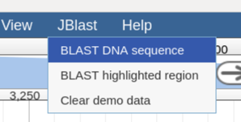

    JBlast Menu

.. figure:: img/blast-dna-seq.png

    BLAST a DNA sequence dialog box

Choose a workflow that will perform the BLAST operation.  In the field *Input Sequence to BLAST*, Paste (Ctrl-V) a sequence. 
The Sample Sequence button may or may not be there depending on the configuration (See :ref:`jbs-sample-seq-button`).

.. _jblast-select-region:

BLAST a region
--------------

Selecting an arbitrary region to BLAST.  This is done with the highlight feature of JBrowse.
    the highlight button on the toolbar, when pressed, will allow you to select an arbitrary region to highlight.
    After highlighting, right click the highlighted region (where there is no track).

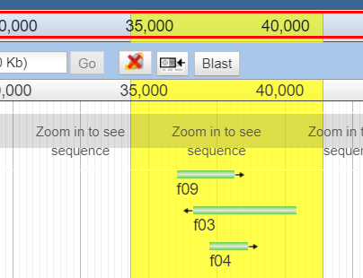

This can also be accessed from the JBlast menu.

BLAST an existing feature
-------------------------

Select a feature from an existing track.

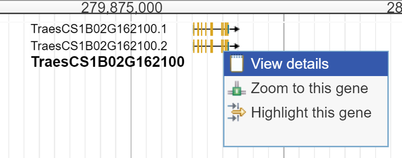

    Open the Details dialog box for the selected feature.

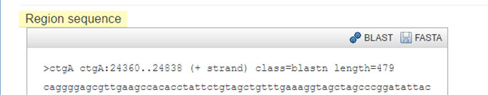

    Click the BLAST button in the feature Details dialog box.

.. _jblast-select-workflow:

Select Workflow
---------------

When a region is selected, this dialog box will appear.  Choose from the list of workflows to be executed 
and click Submit. This will submit the selected region for processing using the selected workflow.

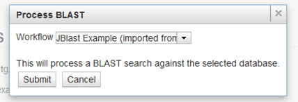

Job Queue Panel
---------------

The job queue side panel is revealed by clicking the Jobs tab on the upper right of JBrowse screen.
This contains list of executing jobs, in our case, for processing workflows.  It tells the current state
of each job and whether completed jobs are completed or errored. 

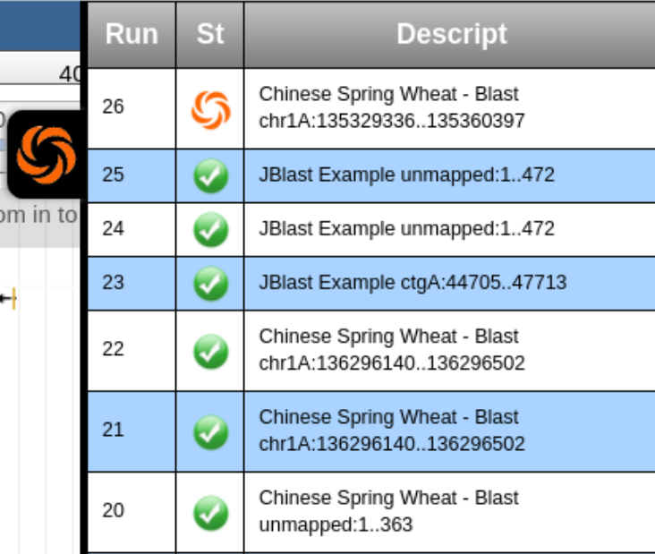

Filter Panel
------------

The filter panel consists of filter sliders and the result table.

When a blast result track is selected with the track selector, the BLAST Filter
panel will appear asa tab next to the Select Tracks tab when the result track is in focus.  Filter Sliders (top are available for filtering by
score, e-value, identity, and gaps.  As the slider positions are moved, the filtered result
track will be updated reflecting the filtered hits.

.. image:: img/filter-panel-target-mode.png

The Result Table (bottom) which shows the filtered results and allows the user to click the row to jump to the selected location. 
Note: the Result Table only appears if the `featureMapping='hit'` (see :ref:`jblast-feature-mapping`)

View Feature Details
--------------------

When a blast hit feature is selected, it's feature details will contain information about 
the blast hit and organism information, accession link, etc.

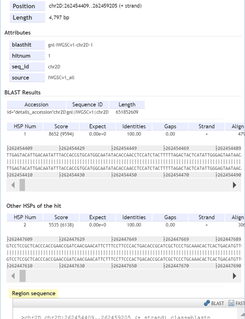

Galaxy
======

The following show how JBlast affects the Galaxy interface.

Workflow Graph
--------------

This screen shows a sample JBlast workflow's graph.

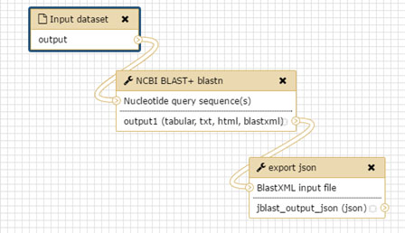

History
-------

JBlast operations are processed in a specific Galaxy history.
This history name is defined in the config file (see :ref:`jbl-globals-js`).

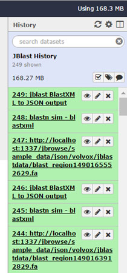

JBlast Tools
------------

This shows the JBlast and NCBI tools in the tools sidebar.

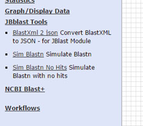

*Note: NCBI Blast tools are not installed by the ``jbutils --setuptools`` script. 
the user must manually install these through the Tool Shed as admin.*

JBlast Galaxy Workflows
-----------------------

JBlast has a fully functional workflow and 2 simulation workflows.
The simulation workflows will only simulate a fixed blast result for demonstration purposes.

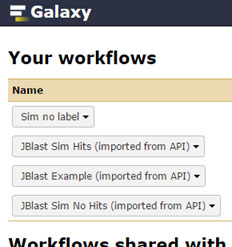

JBlast Process
==============

The typical JBlast process starts with the JBrowse client.  

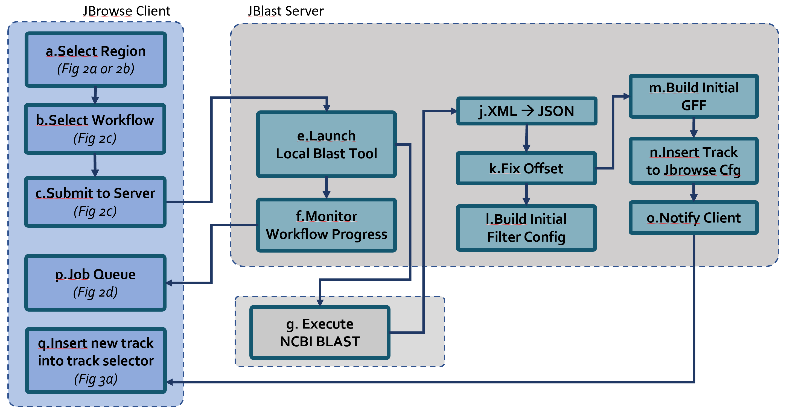

    Processing for Stand-Alone mode

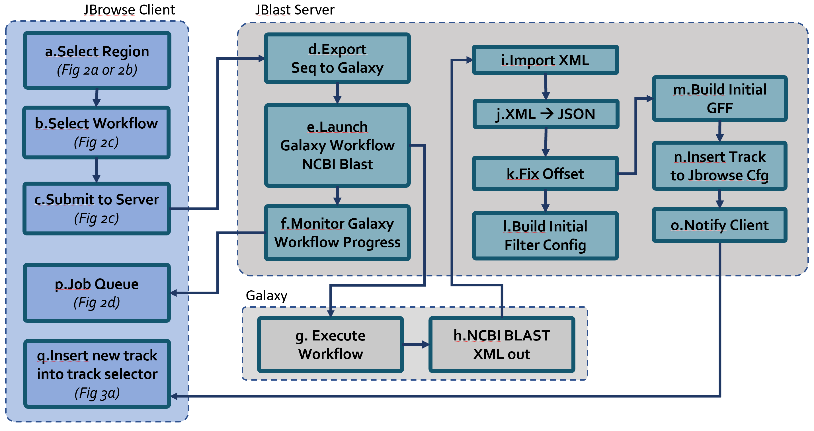

    Processing for Galaxy integration mode

Select Region
-------------

A region is selected using one of two methods, either by highlighting an 
arbitrary region of a sequence or by selecting an existing feature.

This is an example of selecting a feature to blast:

See: :ref:`jblast-select-region` for alternate selection method.

Select & Submit
---------------  

User selects workflow from the list and the region is submitted to the server. 

Details:

The software enumerates the available workflows from the server.  The workflows
may be Galaxy workflows or JBConnect workflows (stand-alone).  The user should
choose workflows with blast operations and the result files are blastxml.

See: :ref:`jblast-select-workflow`

Upload selected sequence and start workflow
-------------------------------------------

Upon submitting, the selected region is passed to the server (in the submit operation).
The submission causes a FASTA file is generated for the region in the jblastdata directory.
The selected workflow is started, which uploads the FASTA file to the workflow engine.

The offset of the sequence is saved for later use.

Monitor workflow
----------------

A workflow monitor thread is kicked off to monitor the progress of the workflow.
The result files for JBlast workflows are generally blastxml files.

The workflow monitor is designed to monitor a workflow that may generate multiple result files, assuming
blast searches may occur in serial or parallel, depending on the configureation of Galaxy
or the JBConnect workflow engine.

The workflow monitor code is specific to the blast operation monitoring.

XML to JSON
-----------

For each resulting blastxml file, XML is converted to a JSON file with hits arranged as a associative array,
for easier lookup. 

The results are referred to as an *asset* with a generated asset id.

Offset Fix
----------

Since the resulting blastxml hit results are independent of offset of the original sequence location, 
the offset must be applied to the results.  This operation is done to the resulting JSON file
so that the data can be represented as a result relative to the original dataset sequence.

Filter Settings
---------------

The filter settings file ``<asset>.filtersettings`` is the persistence mechanism for the current state
filter settings for the asset.

The initial state of the blast filter is first built in this file.  Later, when the user tunes
the graphical sliders in jbrowse, the current vals will change.

The file is used as the basis for generating the filtered GFF file, which is generated each time
the filter settings are changed/updated.

The format of the file looks like this:

::

    {
       "score":{
          "type":"abs",
          "min":58,
          "max":593,
          "val":440
       },
       "evalue":{
          "type":"exp",
          "min":-164.2246437232114,
          "max":-3.535684861138325,
          "val":-3.535684861138325
       },
       "identity":{
          "type":"pct",
          "min":78,
          "max":100,
          "val":78
       },
       "gaps":{
          "type":"pct",
          "min":0,
          "max":13,
          "val":13
       }
    }

The format of the files is designed to be extensible to potentially contain other filterable values.
Although, the current filter interface is not flexible enough to fully take advantage of it. 
In other words, the code currently only supports these 4 values.

Generate Initial GFF
--------------------

The ``<asset>.GFF`` file contains the visible features that are the result of the dynamic filter operation
and the results are driven by the ``<asset>.filtersettings``.

The initial state of the ``<asset>.GFF`` file is unfiltered (i.e. contains all feature hits.)

Build track and add to configuration.
-------------------------------------

With ``<asset>.filtersettings`` and ``<asset>.GFF`` created, now, the a track configuration
is built with ``inMemTemplate.json`` as a baseline.  The track configuration is then inserted
in the track database and the client is notified.

This is the basic track config that is built:

::

    {
        "maxHeight": 1200,
        "storeClass": "JBrowse/Store/SeqFeature/GFF3",
        "blastData": "jblastdata/sampleResult.json",
        "type": "JBrowse/View/Track/HTMLFeatures",
        "metadata": {
            "description": "Sample JBlast result track"
        },
        "category": "JBlast Results",
        "key": "Sample result track",
        "label": "jblast_sample",
        "urlTemplate": "/jbapi/gettrackdata/jblast_sample/sample_data%2Fjson%2Fvolvox%2F",
        "baseUrl": "/",
        "storeCache": false
    }

Note ``storeCache: false`` configuration.  This tells JBrowse not to cache the track so that
each time the GFF track is redrawn, it will reread the data from the filtered GFF file. 

Test Framework
==============

Test framework uses

* Mocha for unit test
* Nightwatch for end-to-end, supporting phantomjs, selenium and online service such as browserstack.
* Istanbul for coverage

To execute

``npm test``

by default nightwatch is setup for phantomjs.
Selenium requires running an additional selenium server
Browserstack has not been tested.

Documentation Framework
=======================

For integrated documentation, `JSdoc3 <http://usejsdoc.org/>`_ is used 
to generate API docs from code with jsdoc-sphinx, a jsdoc template that generates 
RestructuredText (RST) and Sphinx.  This enables support for 
`readthedocs <https://readthedocs.org/>`_.

See: `RST/Sphinx Cheatsheet <http://openalea.gforge.inria.fr/doc/openalea/doc/_build/html/source/sphinx/rest_syntax.html>`_  

``npm run gendocs``
