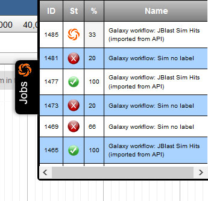

********
Features
********

.. _jbs-features:

JBServer is a Sails.js application
**********************************

JBServer utilizes Sails.js, provideing the following features:

+-------------------------------------------------------------------------------+
| **Javascript** (NODE-based)                                                   |
+-------------------------------------------------------------------------------+
| **Blueprints** Auto-generate  CRUD APIs, ESTful APIs, Socket.io (events)      |
+-------------------------------------------------------------------------------+
| **Waterline** ORM, Any Database, MySql, PostgreSQL Mongo, Redis, local        |
+-------------------------------------------------------------------------------+
| **Express-based** Compatible routes & Middleware                              |
+-------------------------------------------------------------------------------+
| **Socket.io** sub/pub, WebSockets, Auto Integrate Models                      |
+-------------------------------------------------------------------------------+
| **Passport.js** role-based security, access control, OAuth                    |
+-------------------------------------------------------------------------------+
| **Installable** Hooks (jbh-*), Extensible plugin framework                    |
+-------------------------------------------------------------------------------+
| **Grunt** Customizable asset workflow, LESS, SASS, Stylus                     |
+-------------------------------------------------------------------------------+
| **Front-End Agnostic** Angular, backbone, bootstrap, ember, ...               |
+-------------------------------------------------------------------------------+

Directory Layout
================

::

    JBServer project
    ├── api                             Standard sails API layout
    ├── assets                          contains client accessible assets
    ├── bin                             Utilities
    ├── config                          Configuration files.
    │   ├── globals.js                  Config file for module
    │   └── libroutes.js                Library Routes
    ├── data                            Contains the local database file
    │   └── localDiskDb.db              Local database file
    ├── docs                            Documentation
    │   └── genapi-rst                  jsdoc generated rst files
    ├── plugins                         Client-side Plugins
    │   └── JBClient                    Client plugin             
    ├── test                            Test
    ├── views                           View pages
    ├── Gruntfile.js                    Grunt config
    ├── jbutil                          JBServer Utility
    └── package.json

jbutil Command
==============

``jbutil`` is a setup/configuration utility for JBServer.  jbh-hook can extend
``jbutil`` command options. (see: :ref:`jbs-hooks-extend`)

This example shows that ``jbh-jblast`` adds a number of commands to ``jbutil``

::

    $ ./jbutil --help
    Usage: jbutil [OPTION]
          --config            display merged config
          --blastdbpath=PATH  (jblast) existing database path
          --setupworkflows    (jblast) [install|<path>] "install" project wf, or specify .ga file 
          --setuptools        (jblast) setup jblast tools for galaxy
          --setupdata         (jblast) setup data and samples
          --setupindex        (jblast) setup index.html in the jbrowse directory
          --setuphistory      setup history
      -h, --help              display this help

.. _jbs-queue-framework:

Queue Framework
===============

JBServer uses `Kue <https://automattic.github.io/kue/>`_ as the queue framework.  
Since Kue requires `redis <https://redis.io/>`_ database, 
redis server must be running.  An integrated job panel is available when
the JBClient plugin is active. (see: :ref:`jbs-jbclient`)

For diagnostic purposes, a Kue utility can be used to view/manage the Kue database
content: ``http://localhost:1337/kue``

This route can be disabled with in config/http.js.

.. _jbs-globals-config:

Configuration
=============

JBrowse configurations are in ``config/globals.js``

:: 

    jbrowse: {
        jbrowseRest: "http://localhost:1337",       // path accessible by web browser
        jbrowsePath: jbPath,                        // or point to jbrowse directory (ie. "/var/www/jbrowse/") 
        routePrefix: "jbrowse",                     // jbrowse is accessed with http://<addr>/jbrowse
        dataSet: [
            {
                dataPath: "sample_data/json/volvox" // registered datasets.  
            }
        ]
    }

Library Routes
==============

libroutes maps dependancy routes for client-side access.
These are routes to modules that are required for use by the client-side 
plugins or other client-side code.
The framework looks for libroutes.js in jbh- (hook modules), in their respective config directories

For example: for the module jquery,
The module is installed with 'npm install jquery'
The mapping the mapping 'jquery': '/jblib/jquery'
makes the jquery directory accessible as /jblib/jquery from the client side.

``config/libroutes.js``:

::

    module.exports = {
        lib: {
                'jquery.mb.extruder':       '/jblib/mb.extruder',
                'jQuery-ui-Slider-Pips':    '/jblib/slider-pips',
                'jquery-ui-dist':           '/jblib/jquery-ui'
        }
    };

Standalone Register / Login / Logout Routes
===========================================

Stand-alone routes allow for basic register/login/logout functionality free
from the JBrowse interface.  

Stand-alone interfaces use `bootstrap <http://getbootstrap.com/>`_

Register: ``http://<address>:1337/register``

.. image:: img/register.jpg

Login: ``http://<address>:1337/login``

.. image:: img/login.jpg

Logout: ``http://<address>:1337/logout``

Get Login State: ``http://<address>:1337/loginstate``

.. _jbs-jbclient:

Integrated JBrowse Interfaces
=============================

JBrowse GUI intetrated interfaces are available when the ``JBClient`` plugin is 
configured on in the JBrowse client. 

To enable integrated features within the JBrowse app, modify the dataset's 
``trackList.json``, adding ``JBClient`` plugin to the configuration.

*Note: the JBClient plugin is not physically in the JBrowse plugin directory.
It is available as a route.*

::

  "plugins": [
    "JBClient",                    <-----
    "NeatHTMLFeatures",
    "NeatCanvasFeatures",
    "HideTrackLabels"
  ],

Login/Logout Panel
------------------

Login Panel

.. image:: img/login-integrated.jpg

Loguot Panel

.. image:: img/logout-integrated.jpg

Job Queue Panel
---------------

JBServer uses *Kue* as the queue framework.  Since Kue requires *redis* database, 
redis server must be running.  An integrated job panel is available when
the JBClient plugin is active. (see: :ref:`jbs-jbclient`)

Integrated Job Panel:

Test Framework
==============

Test framework uses

* Mocha for unit test
* Nightwatch for end-to-end, supporting phantomjs, selenium and online service such as browserstack.
* Istanbul for coverage

To execute

``npm test``

by default nightwatch is setup for phantomjs.
Selenium requires running an additional selenium server
Browserstack has not been tested.

Documentation Framework
=======================

For integrated documentation, `JSdoc3 <http://usejsdoc.org/>`_ is used 
to generate API docs from code with jsdoc-sphinx, a jsdoc template that generates 
RestructuredText (RST) and Sphinx.  This enables support for 
`readthedocs <https://readthedocs.org/>`_.

See: `RST/Sphinx Cheatsheet <http://openalea.gforge.inria.fr/doc/openalea/doc/_build/html/source/sphinx/rest_syntax.html>`_  

``npm run gendocs``
