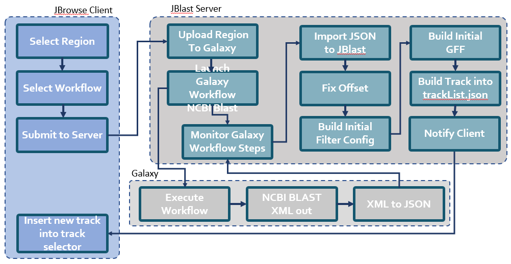
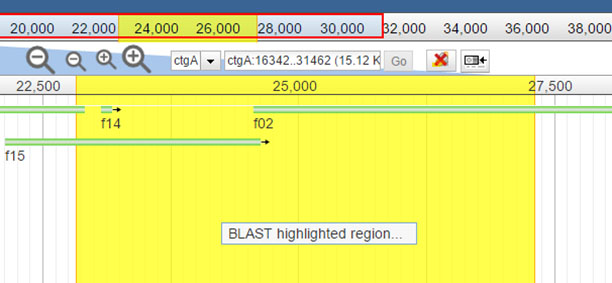
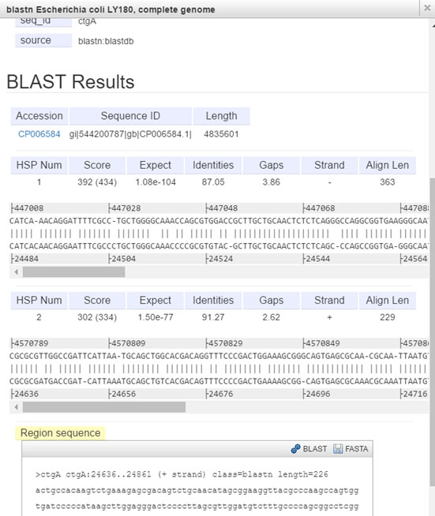

********
Features
********

Proxy to Galaxy Server
History Monitor
Blast Workflow Execution and Monitor
Blast Filter API

Submit region for blast search
Inject result track into trackList.json w/ dynamic track update in track selector
Dynamic Filter Panel
Blast Feature Detail Panel
Visual Queue Monitor

.. _jbs-features:

JBServer is a Sails.js application
**********************************

JBServer utilizes Sails.js, provideing the following features:

.. _jbs-queue-framework:

Queue Framework
===============

JBServer uses `Kue <https://automattic.github.io/kue/>`_ as the queue framework.  
Since Kue requires `redis <https://redis.io/>`_ database, 
redis server must be running.  An integrated job panel is available when
the JBClient plugin is active. (see: :ref:`jbs-jbclient`)

For diagnostic purposes, a Kue utility can be used to view/manage the Kue database
content: ``http://localhost:1337/kue``

This route can be disabled with in config/http.js.

.. _jbs-globals-config:

Configuration
=============

JBrowse configurations are in ``config/globals.js``

:: 

    jbrowse: {
        jbrowseRest: "http://localhost:1337",       // path accessible by web browser
        jbrowsePath: jbPath,                        // or point to jbrowse directory (ie. "/var/www/jbrowse/") 
        routePrefix: "jbrowse",                     // jbrowse is accessed with http://<addr>/jbrowse
        dataSet: [
            {
                dataPath: "sample_data/json/volvox" // registered datasets.  
            }
        ]
    }

Library Routes
==============

libroutes maps dependancy routes for client-side access.
These are routes to modules that are required for use by the client-side 
plugins or other client-side code.
The framework looks for libroutes.js in jbh- (hook modules), in their respective config directories

For example: for the module jquery,
The module is installed with 'npm install jquery'
The mapping the mapping 'jquery': '/jblib/jquery'
makes the jquery directory accessible as /jblib/jquery from the client side.

``config/libroutes.js``:

::

    module.exports = {
        lib: {
                'jquery.mb.extruder':       '/jblib/mb.extruder',
                'jQuery-ui-Slider-Pips':    '/jblib/slider-pips',
                'jquery-ui-dist':           '/jblib/jquery-ui'
        }
    };

JBlast Workflow
===============

Selecting Feature/Region
------------------------

.. image:: img/blast-from-feature.jpg

Select Workflow
---------------

.. image:: img/select-dialog.jpg

Job Queue Panel
---------------

.. image:: img/job-panel.jpg

Filter Panel
------------

.. image:: img/filter-panel.jpg

View Feature Details
--------------------

Galaxy
======

.. image:: img/galaxy-graph.jpg

.. image:: img/galaxy-history.jpg

.. image:: img/galaxy-blast-tools.jpg

.. image:: img/galaxy-workflows.jpg

Test Framework
==============

Test framework uses

* Mocha for unit test
* Nightwatch for end-to-end, supporting phantomjs, selenium and online service such as browserstack.
* Istanbul for coverage

To execute

``npm test``

by default nightwatch is setup for phantomjs.
Selenium requires running an additional selenium server
Browserstack has not been tested.

Documentation Framework
=======================

For integrated documentation, `JSdoc3 <http://usejsdoc.org/>`_ is used 
to generate API docs from code with jsdoc-sphinx, a jsdoc template that generates 
RestructuredText (RST) and Sphinx.  This enables support for 
`readthedocs <https://readthedocs.org/>`_.

See: `RST/Sphinx Cheatsheet <http://openalea.gforge.inria.fr/doc/openalea/doc/_build/html/source/sphinx/rest_syntax.html>`_  

``npm run gendocs``
