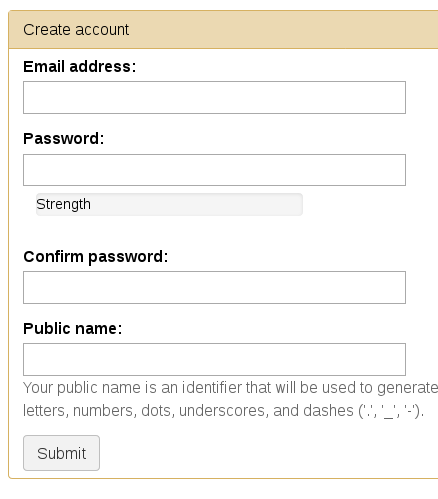

.. _jbs-setup-galaxy :

Setup Galaxy
============

Instructions for installing and configuring Galaxy for use with JBlast.

Install Galaxy
--------------

Instructions for installing galaxy: `Get Galaxy <https://galaxyproject.org/admin/get-galaxy/>`_

``git clone -b release_17.09 https://github.com/galaxyproject/galaxy.git`` (tested)

Run galaxy: ``sh run.sh``  (From galaxy dir. First time run will take a while)

By default Galaxy is hosted on port 8080: ``http://localhost:8080``

Create a user with admin privilage
----------------------------------

Register a new user (**User** Menu --> Register).

In your ``jbconnect`` directory, edit ``jbconnect.config.js`` and create a ``galaxy:`` section under ``jbrowse:`` section.  Add the Galaxy installation path.

::

    module.exports = {
      jbrowse: {
        galaxy: {
          galaxyPath: '/var/www/galaxy'
        }
      }
    }

These settings will override any settings in ``node_modules/jbconnect-hook-jblast/config/globals.js`` and ``jbconnect/config/globals.js``. 

From the JBrowse directory, type ``./jbutil --setuptools``

This will copy some JBlast specific Galaxy tools into the ``galaxy`` directory as as well as replace 
``config.galaxy.ini`` in the ``galaxy`` directory.

In ``galaxy`` directory, add the following line to ``config/galaxy.ini`` add the user email for the user you created as an admin:

::

    admin_users = me-user@gmail.com

Start Galaxy again from the galaxy directory (``sh run.sh``)

Now you should see and **Admin** menu appear in Galaxy.

Generating the Galaxy API key
-----------------------------

Create an API key (**User** Menu --> Preference), then select **Manage API Key**, click the **Create a new key** button.

.. image:: img/galaxy-apikey.png

In the JBConnect directory, add the API key to jbconnect.config.js under the galaxy: section.

::

    module.exports = {
      jbrowse: {
        galaxy: {
          galaxyPath: '/var/www/galaxy',
          galaxyAPIKey: "c7be32db9329841598b1a5705655f633"
        }
      }
    }

Now, restart galaxy: ``sh run.sh``

Install NCBI Blast+ Tools
-------------------------

At the same level as ``jbconnect`` and ``galaxy`` directories, create a directory called ``shed_tools``, making sure it has the same permissions as the ``galaxy`` and ``jbconnect`` directories.

Select the **Admin** menu and **Search Tool Shed** from the left side bar.

Select the **Galaxy Main Tool Shed**: 

.. image:: img/galaxy-main-toolshed.PNG

In the search box enter ``ncbi_blast_plus``.

.. image:: img/galaxy-ncbi-install-blast.PNG

When you come to the Install to Galaxy button, click it.

When you arrive at the screen with **Add new tool panel section**, type in "NCBI Blast+"

.. image:: img/galaxy-add-ncbi-toolpanel.PNG

Then click Install button.

The NCBI blast tools and dependencies will proceed to be installed.

Sometimes you will have to do this procedure a 2nd or 3rd time to ensure all the dependencies are installed.

Install demo workflows
----------------------

Install sample workflows used in demo.  (this step require the API key to be configured and Galaxy
should be running.)

``./jbutil --setupworkflows``

Registering a Blast Database
----------------------------

A default database called faux is a small sample blast database is loaded by the project.

Additional databases may be loaded if necessary.

Download the blast database if you haven't already done it.

::

   ./bin/blast_downloadDb.js htgs.05   (setup sample database)
           // you can also download the full "htgs" database, but this will
           // take a while on slower lines. (ie. "./blast_downloadDb.js htgs" )

This downloads and installs **"htgs"** BLAST database from ``ftp://ftp.ncbi.nlm.nih.gov/blast/db/``
into blastdb/htgs directory.  

In the ``galaxy`` directory, edit ``tool-data/blastdb.loc``.

Add this line to the end of the file:

``htgs{tab}High Throughput Genomic Sequences (htgs){tab}/var/www/jbconnect/blastdb/htgs/htgs``

*It's important to get the name "htgs" correct.  The name counts in our demo workflow.
The directory should reflect the directory of the installed BLAST database.*

Setup Galaxy Job Service
------------------------

In ``jbconnect`` directory, edit ``node_modules/jbconnect-hook-jblast/config/globals.js`` and add the galaxy job service.

::

        services: {
            'basicWorkflowService':     {enable: false, name: 'basicWorkflowService',  type: 'workflow', alias: "jblast"},
            'galaxyService':            {enable: true,  name: 'galaxyService',         type: 'workflow', alias: "jblast"},
            'filterService':            {name: 'filterService',         type: 'service'},
            'entrezService':            {name: 'entrezService',         type: 'service'}
        },

Restart Galaxy: ``sh run.sh``

Lift sails: ``sails lift``

