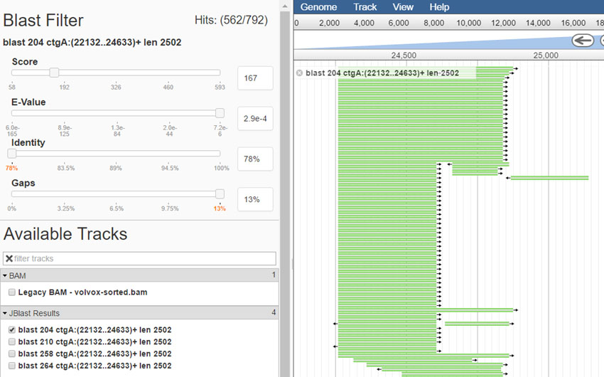

******
JBlast
******

**JBlast - A BLAST service for JBConnect and JBrowse**

JBlast is JBConnect hook module.  It contains both server-side integration
with JBConnect as well as a client-side plugin.

**JBlast User Quick Tutorial**

.. raw:: html

    

        <iframe width="560" height="315" src="https://www.youtube.com/embed/SnJ5sewHJBk" frameborder="0" allow="accelerometer; autoplay; encrypted-media; gyroscope; picture-in-picture" allowfullscreen></iframe>
    

**JBlast provides the following functionality:**

+-------------------------------------------------------------------------------+
| Can leverage Galaxy Server for Blast Analysis or use                          |
| stand-alone NCBI Blast tools                                                  |
+-------------------------------------------------------------------------------+
| Basic workflow abstraction and Monitoring                                     |
+-------------------------------------------------------------------------------+

**The Client-Side JBlast plugin intgration with JBrowse:**

+-------------------------------------------------------------------------------+
| Submit region or existing feature for blast search                            |
+-------------------------------------------------------------------------------+
| Inject result tracks into existing configuration with persistence.            |
+-------------------------------------------------------------------------------+
| Dynamically filter Blast results and save results.                            |
+-------------------------------------------------------------------------------+
| Extended feature details with blast results                                   |
+-------------------------------------------------------------------------------+

Contents
========

.. toctree::
   :maxdepth: 2

   quick_start
   features
   setup
   api

