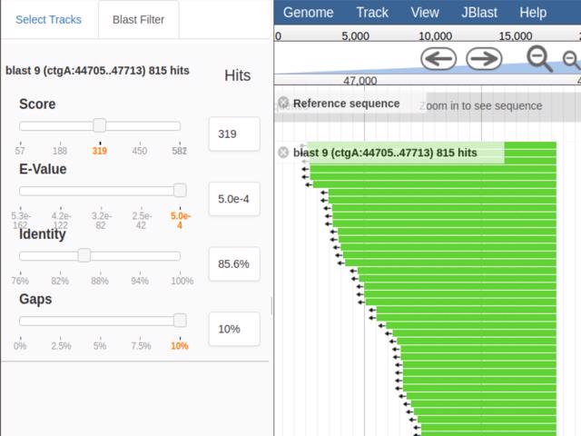
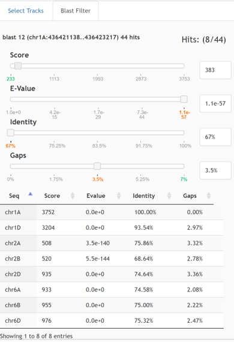

******
JBlast
******

**JBlast - A BLAST service for JBConnect and JBrowse**

JBlast (jblast-jbconnect-hook) is JBConnect hook module. It contains both server-side integration with 
JBConnect and JBrowse that enables Blast analysis that is tightly integrated with JBrowse.   
JBlast can execute stand-alone NCBI blast commands directly, or it can be configured to use Galaxy for workflow processing. 
Through the JBrowse user interface the user can choose to submit an existing feature as a blast query or highlight a 
region to blast. The user can monitor blast execution processing through JBConnect’s job queue 
and the blast search results will appear directly as an inserted track in the track selector.  

    Filter Panel with results mapped to query space

    Filter Panel where feature mapping mode is in target space.

**JBlast User Quick Tutorial**

.. raw:: html

    

        <iframe width="560" height="315" src="https://www.youtube.com/embed/rVkpOuyiul8" frameborder="0" allow="accelerometer; autoplay; encrypted-media; gyroscope; picture-in-picture" allowfullscreen></iframe>
    

**JBlast provides the following functionality:**

+-------------------------------------------------------------------------------+
| Can leverage Galaxy Server for Blast Analysis or use                          |
| stand-alone NCBI Blast tools                                                  |
+-------------------------------------------------------------------------------+
| Basic workflow abstraction and Monitoring                                     |
+-------------------------------------------------------------------------------+

**The Client-Side JBlast plugin intgration with JBrowse:**

+-------------------------------------------------------------------------------+
| Submit region or existing feature for blast search                            |
+-------------------------------------------------------------------------------+
| Inject result tracks into existing configuration with persistence.            |
+-------------------------------------------------------------------------------+
| Dynamically filter Blast results and save results.                            |
+-------------------------------------------------------------------------------+
| Extended feature details with blast results                                   |
+-------------------------------------------------------------------------------+

Quick Start
***********

Instructions for installing JBlast with stand-alone NCBI Blast tools (non-Galaxy). 

To setup Galaxy integration, see `Configure JBConnect with Galaxy`_

(Since JBConnect is generally intended to be a companion of JBrowse.  
JBrowse may also be installed in a separate directory.
(See :ref:`jbs-separate-dir`.)

To integrate with Galaxy, see :ref:`jbs-setup-galaxy`.
 
Pre-Install
===========

JBlast requires `redis <https://redis.io/>`_ as a pre-requisite, which is only used by the queue framework 
(`kue <https://www.npmjs.com/package/kue>`_).  JBConnect depends on Sails.js.

Install *redis* and *sails*

:: 

    yum install redis
    redis-server
    npm install -g sails@1.0.2

Install
=======

Install the JBConnect and JBrowse.  jb_setup.js ensures the sample data is loaded.

::
    
    # install jbconnect
    git clone http://github.com/gmod/jbconnect
    cd jbconnect
    npm install

    # install blast tools and sample data
    npm install enuggetry/blast-ncbi-tools enuggetry/faux-blastdb

    # pull in NCBI blast executables
    ./utils/blast_getBlastUtils.js 2.8.1

    # install jblast
    npm install gmod/jblast-jbconnect-hook

    # install jbrowse & setup jbrowse demo
    npm install @gmod/jbrowse@1.15.1
    patch node_modules/@gmod/jbrowse/setup.sh fix_jbrowse_setup.patch
    ./utils/jb_setup.js

The patch operation is needed to make JBrowse 1.15.1 setup.sh run properly.
If JBrowse is installed in another location, the patch should be run before setup.sh.

Run
===

Launch the server.

:: 

    sails lift

From a web browser, access the application (default login: juser/password).

::

    http://localhost:1337/jbrowse

---------------------

Contents
========

.. toctree::
   :maxdepth: 2

   features
   configuration
   galaxy_setup
   api

