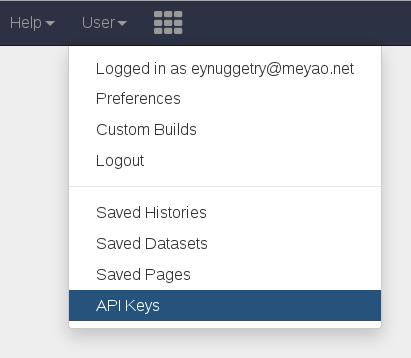
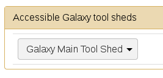
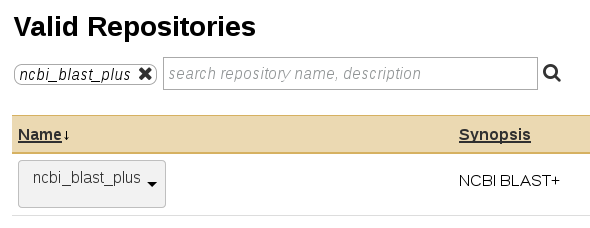
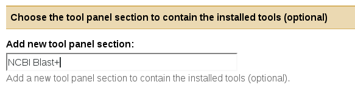

******************
JBlast Quick Start
******************

Instructions for installing JBlast with stand-alone NCBI Blast tools (non-Galaxy). 

To setup Galaxy integration, see `Configure JBConnect with Galaxy`_

(Since JBConnect is generally intended to be a companion of JBrowse.  
JBrowse may also be installed in a separate directory.
(See :ref:`jbs-separate-dir`.)

 
Pre-Install
===========

JBlast requires `redis <https://redis.io/>`_ as a pre-requisite, which is only used by the queue framework 
(`kue <https://www.npmjs.com/package/kue>`_).  JBConnect depends on Sails.js.

Install *redis* and *sails*

:: 

    yum install redis
    redis-server
    npm install -g sails@1.0.2

Install
=======

Install the JBConnect and JBrowse.  jb_setup.js ensures the sample data is loaded.

::
    
    # install jbconnect
    git clone http://github.com/gmod/jbconnect
    cd jbconnect
    npm install

    # install jbrowse & setup jbrowse demo
    npm install @gmod/jbrowse@1.15.1
    ./utils/jb_setup.js

    # install jblast
    npm install gmod/jblast-jbconnect-hook

    # install blast tools and sample data
    npm install blast-ncbi-tools faux-blastdb

    # pull in NCBI blast executables
    ./utils/blast_getBlastUtils.js

Run
===

Launch the server.

:: 

    sails lift

From a web browser, access the application (default login: juser/password).

::

    http://localhost:1337/jbrowse

---------------------

JBrowse Peer Configuration
==========================

JBrowse can be configured in a peer directory instead of a module. 
In this case, bypass the Install JBrowse and Setup Demo step.

For example:

::

    /home
      /zuser
        /JBConnect
        /jbrowse

Create a file called ``jbconnect.config.js`` in the JBConnect app directory that contains the following:

::

    module.exports  = {
        jbrowse: {
            jbrowsePath: "/home/zuser/jbrowse/"
        }
    };

Configure JBConnect with Galaxy
===============================

In your ``jbconnect`` directory, edit ``jbconnect.config.js`` and create a ``galaxy:`` section under ``jbrowse:`` section.  Add the Galaxy installation path.

::

    module.exports = {
      jbrowse: {
        galaxy: {
          galaxyPath: '/var/www/galaxy'
        }
      }
    }

These settings will override any settings in ``node_modules/jbconnect-hook-jblast/config/globals.js`` and ``jbconnect/config/globals.js``. 

From the JBrowse directory, type ``./jbutil --setuptools``

This will copy some JBlast specific Galaxy tools into the ``galaxy`` directory as as well as replace 
``config.galaxy.ini`` in the ``galaxy`` directory.

In ``galaxy`` directory, add the following line to ``config/galaxy.ini`` add the user email for the user you created as an admin:

::

    admin_users = me-user@gmail.com

Start Galaxy again from the galaxy directory (``sh run.sh``)

Now you should see and **Admin** menu appear in Galaxy.

Generating the Galaxy API key
*****************************

Create an API key (**User** Menu --> Preference), then select **Manage API Key**, click the **Create a new key** button.

In the JBConnect directory, add the API key to jbconnect.config.js under the galaxy: section.

::

    module.exports = {
      jbrowse: {
        galaxy: {
          galaxyPath: '/var/www/galaxy',
          galaxyAPIKey: "c7be32db9329841598b1a5705655f633"
        }
      }
    }

Now, restart galaxy: ``sh run.sh``

Install NCBI Blast+ Tools
*************************

At the same level as ``jbconnect`` and ``galaxy`` directories, create a directory called ``shed_tools``, making sure it has the same permissions as the ``galaxy`` and ``jbconnect`` directories.

Select the **Admin** menu and **Search Tool Shed** from the left side bar.

Select the **Galaxy Main Tool Shed**: 

In the search box enter ``ncbi_blast_plus``.

When you come to the Install to Galaxy button, click it.

When you arrive at the screen with **Add new tool panel section**, type in "NCBI Blast+"

Then click Install button.

The NCBI blast tools and dependencies will proceed to be installed.

Sometimes you will have to do this procedure a 2nd or 3rd time to ensure all the dependencies are installed.

Install demo workflows
************************

Install sample workflows used in demo.  (this step require the API key to be configured and Galaxy
should be running.)

``./jbutil --setupworkflows``

Registering a Blast Database
****************************

Download the blast database if you haven't already done it.

::

   ./bin/blast_downloadDb.js htgs.05   (setup sample database)
           // you can also download the full "htgs" database, but this will
           // take a while on slower lines. (ie. "./blast_downloadDb.js htgs" )

This downloads and installs **"htgs"** BLAST database from ``ftp://ftp.ncbi.nlm.nih.gov/blast/db/``
into blastdb/htgs directory.  

In the ``galaxy`` directory, edit ``tool-data/blastdb.loc``.

Add this line to the end of the file:

``htgs{tab}High Throughput Genomic Sequences (htgs){tab}/var/www/jbconnect/blastdb/htgs/htgs``

*It's important to get the name "htgs" correct.  The name counts in our demo workflow.
The directory should reflect the directory of the installed BLAST database.*

Setup Galaxy Job Service
************************

In ``jbconnect`` directory, edit ``node_modules/jbconnect-hook-jblast/config/globals.js`` and add the galaxy job service.

::

        services: {
            //'basicWorkflowService':     {name: 'basicWorkflowService',  type: 'workflow', alias: "jblast"},
            'galaxyService':          {name: 'galaxyService',         type: 'workflow', alias: "jblast"},
            'filterService':            {name: 'filterService',         type: 'service'},
            'entrezService':            {name: 'entrezService',         type: 'service'}
        },

Restart Galaxy: ``sh run.sh``

Lift sails: ``sails lift``

